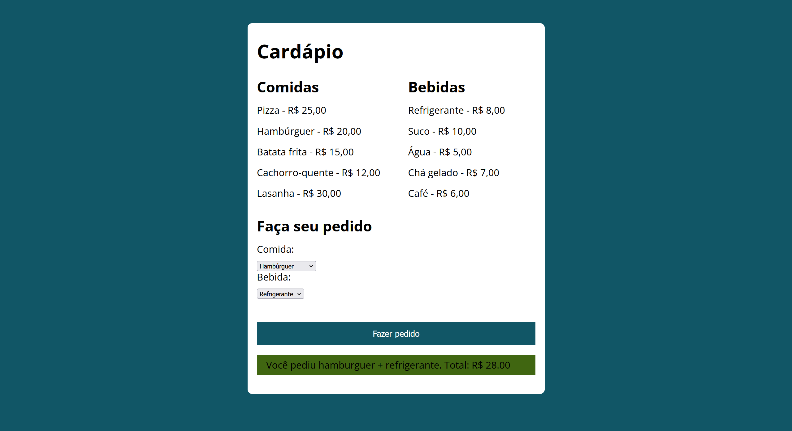

# 🍔 Exercício 01 - Cardápio Interativo

## 📌 Descrição

Neste exercício, você deve criar um cardápio interativo onde o usuário escolhe uma comida e uma bebida, e o sistema retorna o pedido com o valor total.

---

## 🧠 Contexto

Aplicação simples que simula um pedido em um cardápio, utilizando interação com o usuário através de formulário.

---

## 🎯 Objetivo

Praticar:

* HTML (estrutura)
* CSS (layout com flexbox)
* JavaScript (eventos e manipulação do DOM)

---

## 📋 Requisitos

* Selecionar uma comida
* Selecionar uma bebida
* Exibir o pedido na tela
* Calcular o valor total

---

## 📸 Preview

---

## 🚀 Como executar

1. Clone ou baixe o projeto

### 🧪 Praticar exercício

Abra o arquivo `exercicio/index.html`

👉 A solução deve ser desenvolvida dentro da pasta `exercicio/`
👉 Você pode criar seus próprios arquivos (CSS, JavaScript, etc.) conforme necessário
👉 Sugestão: tente organizar seu projeto (ex: pasta `assets`, `css`, `js`)

---

### ▶️ Ver solução

Abra o arquivo `index.html`

👉 Utilize a solução apenas como referência após tentar resolver o exercício

---

## 📚 Documentação

* [Explicação da solução](./docs/SOLUCAO.md)
* [Dúvidas comuns](./docs/DUVIDAS.md)
* [Erros comuns](./docs/ERROS_COMUNS.md)
* [Desafios](./docs/DESAFIOS.md)

---

## 💡 Aprendizados

* Uso de HTML para estruturação de páginas
* Uso de CSS para layout com Flexbox
* Manipulação de eventos com JavaScript
* Atualização dinâmica do conteúdo com DOM
